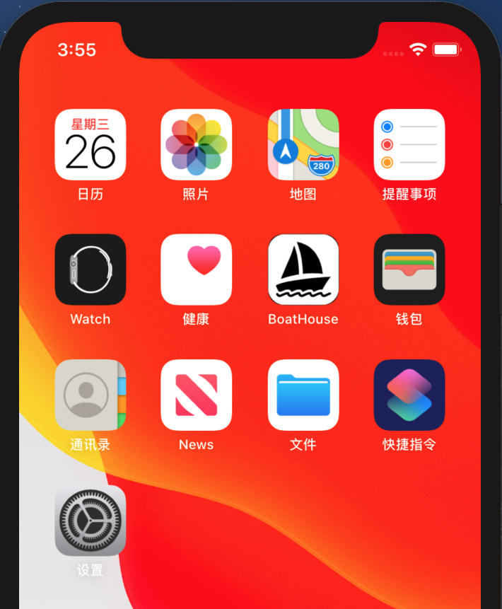
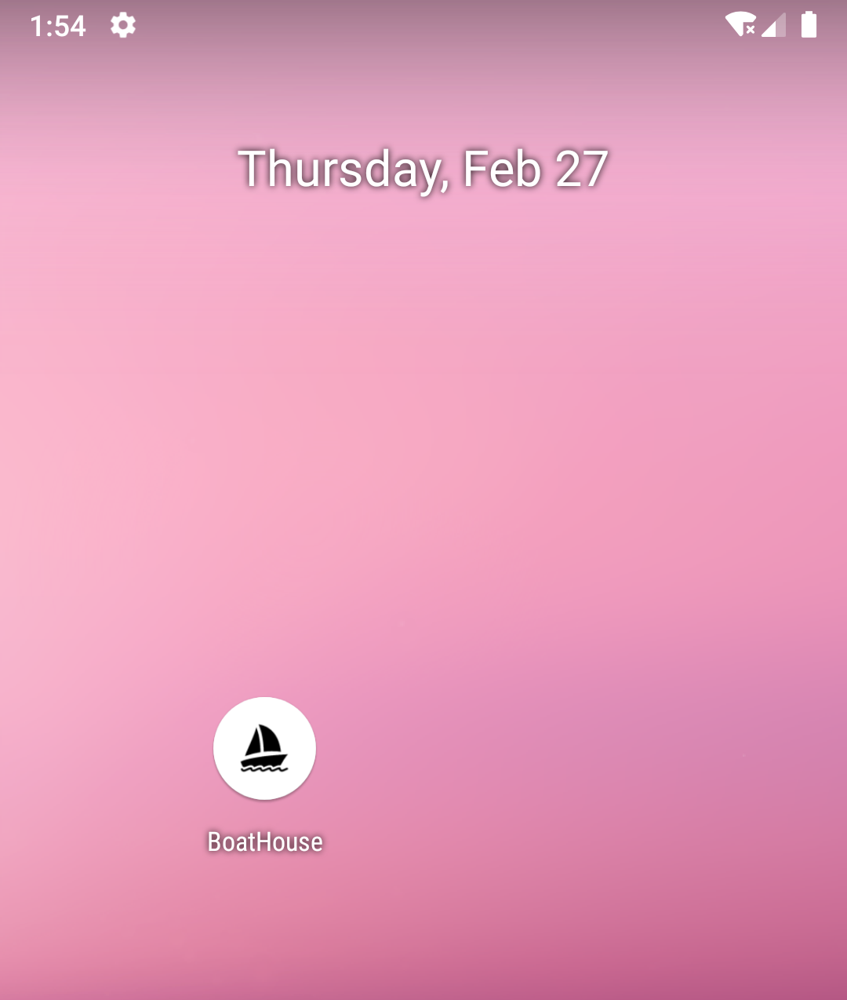
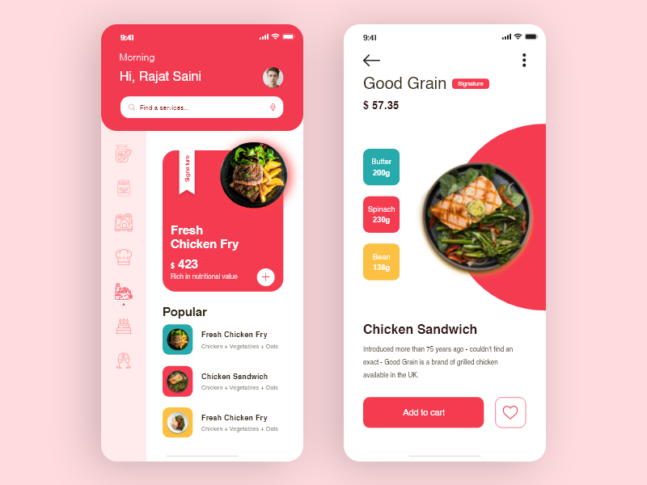

# boat-house-app（船屋餐饮系统移动端）
IDCF Boat House 移动端

## 功能定位

船屋餐饮系统移动端目前采用Xamarin.Froms MVP架构设计。

主要用于在移动端（Android 或 IOS）对船屋餐饮系统进行点餐操作。

## 平台定位
Android, IOS.

## Features
* CollectionView.
* Styles.
* MVP.

## Logo && 预览

## UI设计预参考

A Xamarin.Forms sample based on the [dribble designs by Rajat](https://dribbble.com/shots/8970618-Food-App).

